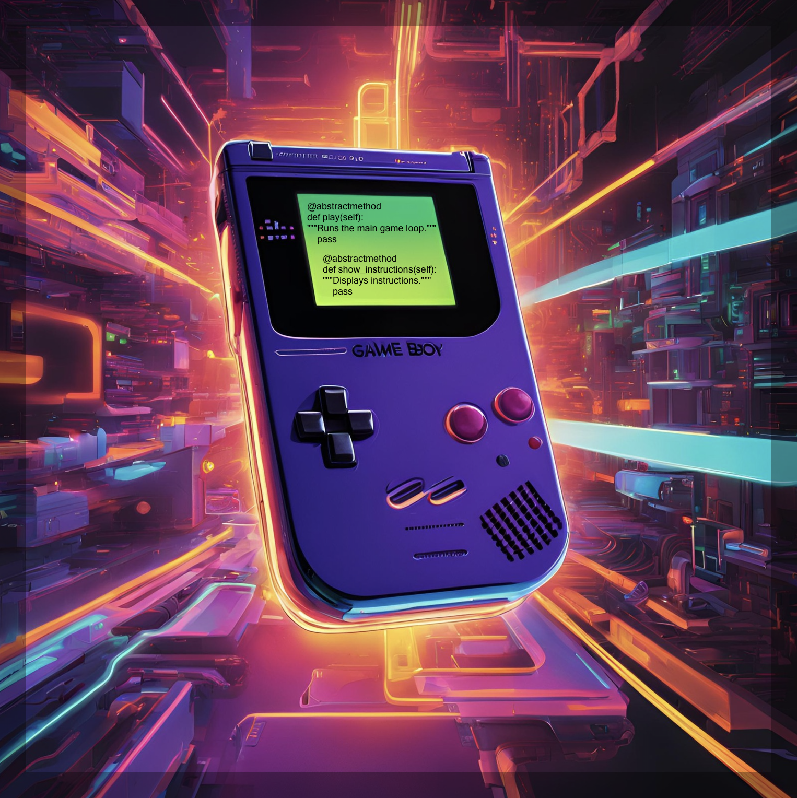

# 🎮 Python Playground



**PyPlayground** is a project that brings together several classic games developed in Python, designed to showcase advanced programming skills, clean and structured code, object-oriented design, and best practices in software development. 

## 🚀 Games Included

1. **Rock, Paper, Scissors** - The classic hand game against another player or the computer.
2. **Hangman** - Guess the hidden word before you run out of attempts.
3. **Tic Tac Toe** - Play the classic "three in a row" game against another player or the computer.
4. **Minesweeper** - Reveal all non-mine spaces without triggering any mines.

Each game is modular, well-documented, and designed to be easy to extend or improve.

---

## 📂 Project Structure

```plaintext
├── assets/                     # Folder for assets like images and media
│   ├── banner.png              # Banner image for the README
├── games/                      # Main folder for all games
│   ├── game_base.py            # Abstract base class for all games
│   ├── rock_paper_scissors.py  # Rock, Paper, Scissors game logic
│   ├── hangman.py              # Hangman game logic
│   ├── tic_tac_toe.py          # Tic Tac Toe game logic
│   ├── minesweeper.py          # Minesweeper game logic
├── main.py                     # Entry point for running the program
├── README.md                   # Project documentation
```


---

## 🛠️ Features

- **Object-Oriented Design:** Extensive use of classes, inheritance, and `@abstractmethod` for a clean and reusable architecture.
- **Error Handling:** Captures and handles common errors for a smooth experience.
- **Clean and Documented Code:** Docstrings and comments are provided for all methods.
- **Modular Design:** Easily add new games or enhance existing ones thanks to the structured approach.

---

## 💻 Requirements

- Python 3.8 or higher.

---

## 📦 Installation

1. Clone this repository:
   ```bash
   git clone https://github.com/MaPitelli/pyplayground.git
   cd pyplayground
   ```

2. Run the program:
   ```bash
   python main.py
   ```

---

## 🕹️ How to Play

After running `main.py`, you'll see a menu to select the game you want to play. Follow the on-screen instructions for each game. At the end of each game, you’ll have the option to replay, switch games, or exit the program.

---

## 👀 Sample Gameplay

### Minesweeper
```
****** Welcome to Minesweeper! ******

Current board:
■ ■ ■ ■ ■ 
■ ■ ■ ■ ■ 
■ ■ ■ ■ ■ 
■ ■ ■ ■ ■ 
■ ■ ■ ■ ■ 

Enter your move (row and column, separated by a space): 1 1

Current board:
X ■ ■ ■ ■ 
■ ■ ■ ■ ■ 
■ ■ ■ ■ ■ 
■ ■ ■ ■ ■ 
■ ■ ■ ■ ■ 

Boom! You hit a mine! Game over.
```

---

## 📚 Next Steps

- [ ] Add new games such as **2048**, **Memory Match** or **Trivia**.
- [ ] Improve board designs for better visuals.
- [ ] Create a graphical user interface (GUI) with Tkinter or Pygame.
- [ ] Save high scores to a file or database.

---

## 🛠️ Feedback

Your feedback is welcome! If you notice any bugs or have suggestions for improvements, feel free to open an issue in the repository. 

---

## ✨ Contact

- **Author:** [Maíra Pitelli](https://github.com/MaPitelli)
- **Email:** mairapitelli@hotmail.com
- **LinkedIn:** [click here to check my LinkedIn profile](https://www.linkedin.com/in/mairapitelli/)

---

## 🌟 Acknowledgements

Thanks to everyone who inspires me to continue learning and improving in Python. I hope this project serves as a useful resource for students and educators.
